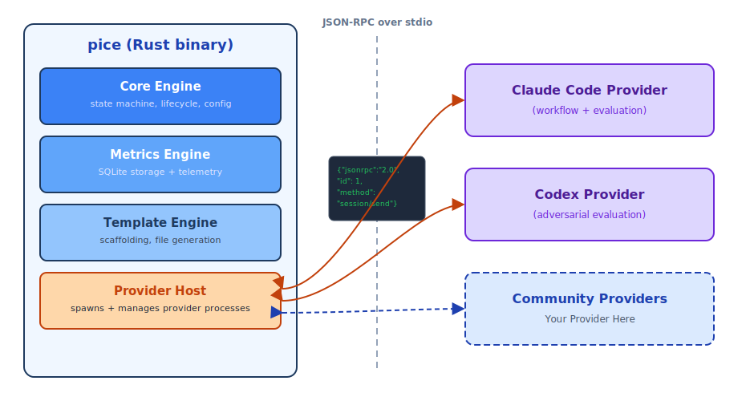
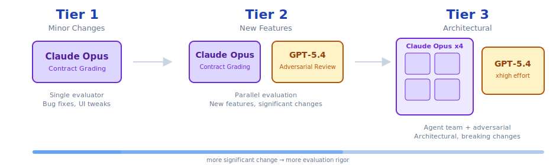

<p align="center">
  
</p>

<h1 align="center">m0lz.02</h1>

<p align="center">
  Structured AI coding workflow orchestrator<br>
  Plan → Implement → Contract-Evaluate with dual-model adversarial evaluation<br>
  <a href="https://m0lz.dev/writing/pice-framework">m0lz.dev/writing/pice-framework</a>
</p>

---


Structured AI coding workflow orchestrator -- Plan, Implement, Contract-Evaluate.

[](https://github.com/jmolz/m0lz.02/actions/workflows/ci.yml)
[](https://github.com/jmolz/m0lz.02/actions/workflows/ci.yml)
[](LICENSE)

<p align="center">
  
</p>

## What is m0lz.02?

m0lz.02 implements the PICE methodology — a structured approach to AI coding that breaks work into three formal phases: **Plan** (research, design, and contract negotiation), **Implement** (code generation from a plan), and **Contract-Evaluate** (adversarial grading of the implementation against the contract). The CLI orchestrates this lifecycle -- it manages the state, the prompts, and the measurement while an AI assistant does the actual coding.

The key differentiator is **dual-model adversarial evaluation**. Instead of asking the same AI that wrote the code to judge it, m0lz.02 runs parallel evaluations from independent models -- Claude grades contract criteria while GPT-5.4 challenges the approach as an adversary. This eliminates the single-model blind spots that plague self-review workflows.

m0lz.02 is the outer loop. It spawns AI providers over a JSON-RPC protocol, feeds them scoped context, captures structured output, and stores quality metrics locally in SQLite. The AI does the coding; m0lz.02 makes sure it is doing it well.

## Installation

### npm (recommended)

```bash
npm install -g @jacobmolz/pice
```

### Cargo

```bash
cargo install pice-cli
```

### GitHub Releases

Download a prebuilt binary for your platform from [GitHub Releases](https://github.com/jacobmolz/pice/releases), extract it, and place it on your `PATH`.

## Quick Start

```bash
# Scaffold PICE framework files in your project
pice init

# Orient on the codebase and get recommended next actions
pice prime

# Research, plan, and generate a contract for a feature
pice plan "add user auth"

# Implement the plan in a fresh AI session
pice execute .claude/plans/auth-plan.md

# Run dual-model adversarial evaluation against the contract
pice evaluate .claude/plans/auth-plan.md

# Code review with regression checks
pice review

# Create a standardized git commit
pice commit
```

## Example

Here's what a Tier 2 dual-model evaluation looks like after implementing a user authentication feature:

```
$ pice evaluate .claude/plans/auth-plan.md

╔══════════════════════════════════════╗
║   Evaluation Report — Tier 2         ║
╠══════════════════════════════════════╣
║ ✅ Auth endpoints return 401     8/7 ║
║   All protected routes verified      ║
║ ✅ Password hashing uses bcrypt  9/7 ║
║   bcrypt with cost factor 12         ║
║ ✅ Session tokens expire in 24h  8/8 ║
║   24h expiry confirmed in tests      ║
║ ✅ No secrets in git history     7/7 ║
║   Clean scan across all commits      ║
╠══════════════════════════════════════╣
║  Adversarial Review                  ║
║  [consider] Rate limiting on logi... ║
║  [consider] Token rotation strate... ║
╠══════════════════════════════════════╣
║  Overall: PASS ✅                    ║
║  All contract criteria met           ║
╚══════════════════════════════════════╝
```

Claude grades each contract criterion with a numeric score against a threshold. GPT-5.4 independently challenges the approach as an adversary — surfacing blind spots neither model would catch alone.

## Commands

| Command | Description |
|---------|-------------|
| `pice init` | Scaffold `.claude/` and `.pice/` directories with framework files |
| `pice prime` | Orient on the codebase and get recommended next actions |
| `pice plan <description>` | Research, plan, and generate a contract for a feature or change |
| `pice execute <plan>` | Implement from a plan file in a fresh AI session |
| `pice evaluate <plan>` | Run adversarial evaluation against a plan's contract |
| `pice review` | Code review and regression suite |
| `pice commit` | Create a standardized git commit |
| `pice handoff` | Capture session state for the next session or agent |
| `pice status` | Display active plans and workflow state |
| `pice metrics` | Aggregate and display quality metrics |
| `pice benchmark` | Before/after workflow effectiveness comparison |
| `pice completions <shell>` | Generate shell completions (bash, zsh, fish, powershell) |

All commands support `--json` for machine-readable output.

## Architecture

m0lz.02 uses a **provider architecture** that separates the Rust core from AI provider implementations:

<picture>
  <source media="(prefers-color-scheme: dark)" srcset="docs/images/architecture-dark.svg">
  
</picture>

The Rust core handles argument parsing, state management, configuration, metrics, and process orchestration. AI providers are separate TypeScript processes that communicate over JSON-RPC on stdio. This design allows community-built providers for any AI coding tool without modifying the core binary.

For provider development, see [`docs/providers/`](docs/providers/).

## Dual-Model Adversarial Evaluation

Evaluation scales with the significance of the change:

<picture>
  <source media="(prefers-color-scheme: dark)" srcset="docs/images/evaluation-tiers-dark.svg">
  
</picture>

Evaluators are **context-isolated** -- they see only the contract JSON, the git diff, and the project's `CLAUDE.md`. They never see the implementation conversation or planning rationale.

## Configuration

m0lz.02 stores project configuration in `.pice/config.toml`, created by `pice init`:

```toml
[provider]
name = "claude-code"

[evaluation.primary]
provider = "claude-code"
model = "claude-opus-4-6"

[evaluation.adversarial]
provider = "codex"
model = "gpt-5.4"
effort = "high"
enabled = true

[telemetry]
enabled = false

[metrics]
db_path = ".pice/metrics.db"
```

Key settings:
- **`provider.name`** -- The AI provider for workflow commands (plan, execute, review, commit).
- **`evaluation.primary`** -- Model for contract grading.
- **`evaluation.adversarial`** -- Model for adversarial review. Set `enabled = false` to use single-model evaluation only.
- **`telemetry.enabled`** -- Opt-in anonymous telemetry (see below).

### Environment Variables

| Variable | Required for |
|----------|-------------|
| `ANTHROPIC_API_KEY` | Claude Code provider (workflow + evaluation) |
| `OPENAI_API_KEY` | Codex provider (adversarial evaluation) |

## Shell Completions

Generate completions for your shell and add them to your profile:

**Bash:**
```bash
pice completions bash > ~/.local/share/bash-completion/completions/pice
```

**Zsh:**
```bash
pice completions zsh > ~/.zfunc/_pice
# Ensure ~/.zfunc is in your fpath before compinit
```

**Fish:**
```bash
pice completions fish > ~/.config/fish/completions/pice.fish
```

## Telemetry

Telemetry is **opt-in** and **off by default**. When enabled, m0lz.02 collects anonymous usage metrics (command frequency, evaluation pass rates, workflow timing) to improve the tool. No code, prompts, or personally identifiable information is collected.

Telemetry data is fully inspectable in `.pice/telemetry-log.jsonl` before any data leaves your machine. To enable:

```toml
# .pice/config.toml
[telemetry]
enabled = true
```

## FAQ

### Why not just use aider/cursor/copilot?

m0lz.02 is the orchestration layer, not a replacement for your AI coding tool. It works *with* tools like Claude Code, Cursor, or Copilot through a provider protocol — managing the lifecycle, enforcing contracts, and measuring quality while your preferred tool does the coding. Think of it as the CI/CD for AI coding sessions.

### Why Rust + TypeScript?

Rust for the CLI core — it's fast, compiles to a single binary, and handles process orchestration well. TypeScript for providers — AI SDKs (Anthropic, OpenAI) are JavaScript-first, and the provider protocol lets each side use its natural language. The two communicate over JSON-RPC on stdio.

### Is the telemetry sketchy?

No. Telemetry is opt-in and off by default. When enabled, it collects anonymous usage metrics (command frequency, evaluation pass rates, timing) — never code, prompts, or personal information. All telemetry data is written to `.pice/telemetry-log.jsonl` where you can inspect every event before anything leaves your machine.

### Does this actually improve code quality?

That's what the metrics engine is designed to answer. m0lz.02 tracks evaluation scores, pass rates, and workflow timing across your sessions so you can see whether structured workflows produce measurably better results than ad-hoc AI coding. Data over vibes.

## Roadmap

m0lz.02 v0.1 ships the core loop. The [roadmap](docs/roadmap.md) covers what's next — grounded in empirical research and mathematical foundations:

- **v0.2 — Stack Loops** — per-layer PICE loops across the technology stack with seam verification at every boundary. [Why: software breaks at integration points, not inside components.](docs/roadmap.md#the-seam-problem)
- **v0.3 — Arch Experts** — dynamically generated specialist agents inferred from your project's architecture files.
- **v0.4 — Implicit Contract Inference** — automated cross-component assumption asymmetry detection from code and traffic.
- **v0.5 — Self-Evolving Verification** — a closed-loop system where every execution makes the next one smarter, more targeted, and cheaper.

Supporting research: [seam blindspot analysis](docs/research/seam-blindspot.md), [convergence analysis](docs/research/convergence-analysis.md), [originality analysis](docs/research/originality-analysis.md), and more in [`docs/research/`](docs/research/).

For term definitions, see the [glossary](docs/glossary.md).

## Contributing

See [CONTRIBUTING.md](CONTRIBUTING.md) for development setup, coding standards, and contribution guidelines.

### Development

```bash
# Rust
cargo build
cargo test
cargo clippy -- -D warnings
cargo fmt --check

# TypeScript
pnpm install
pnpm build
pnpm test
pnpm lint
pnpm typecheck
```

## License

MIT -- see [LICENSE](LICENSE) for details.
